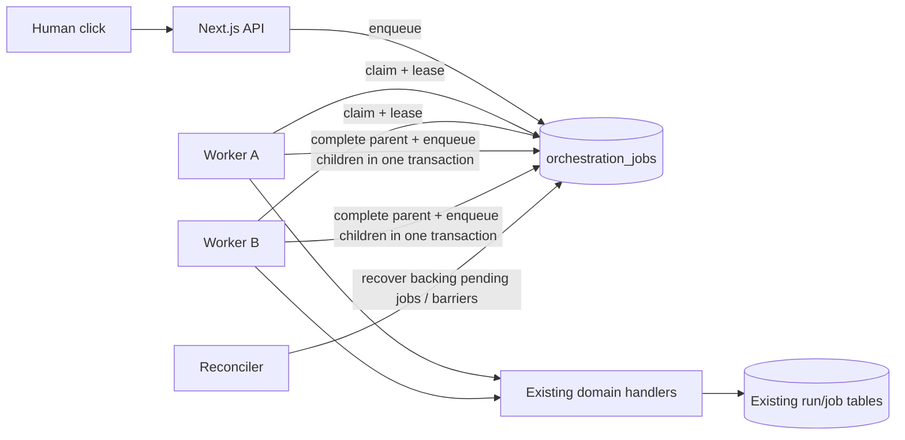

# 12 — Durable Postgres orchestration

This document supersedes the Inngest transport in `10-jobs-and-events.md`.
Business job state remains in the existing enrichment/drafting tables.
`outreach.orchestration_jobs` is the durable transport and transactional outbox.

## Runtime

- Apply schema: `npm run db:orchestration`
- Local dev: `npm run dev` (starts Next.js + worker together)
- Worker only: `npm run worker` (production service or debugging)
- Inspect workers/queue/failures: `npm run worker:status`
- Verify DB claim behavior: `npm run verify:orchestration`
- Production runs the same `npm run worker` command in a dedicated service.
  `Dockerfile.worker` is provided for Railway, Render, Fly, or another container host.
- Scale horizontally by starting more worker replicas. Postgres enforces lane limits.

## Lanes

- `extraction`: `ORG_EXTRACTION_CONCURRENCY`, default 10
- `research`: `ORG_RESEARCH_CONCURRENCY`, default 8
- `profile_rescue`: `ORG_PROFILE_RESCUE_CONCURRENCY`, default 12
- `email_rescue`: `ORG_EMAIL_RESCUE_CONCURRENCY`, default 12
- `finalize`: `ORG_FINALIZE_CONCURRENCY`, default 4
- `domain_verify`: `ORG_VERIFY_CONCURRENCY`, default 6
- `mailbox_verify`: `ORG_MAILBOX_VERIFY_CONCURRENCY`, default 12
- `mailbox_sweep`: fixed 2
- `drafting`: `ORG_DRAFT_RESEARCH_CONCURRENCY`, default 4
- `maintenance`: fixed 1

Claims take a transaction advisory lock per lane, count active unexpired leases,
then select with `FOR UPDATE SKIP LOCKED`. Jobs are ordered by priority, then by
active jobs in the same `scope_key`, then FIFO. This prevents one campaign from
occupying every new slot while preserving priority.

## Reliability contract

- Duplicate enqueue: unique `(kind, dedupe_key)`.
- Worker crash: heartbeat-backed lease; expired jobs are reclaimable.
- Poison job: bounded `max_attempts`, then terminal `failed`.
- Handler failure: exponential backoff with jitter; provider-specified retry delay wins.
- Follow-up loss: parent completion and child queue inserts share one transaction.
- Mailbox probe duplication: a durable send intent is inserted before AgentMail.
  A crash with an uncertain remote outcome is surfaced as unknown and is never
  blindly resent.
- Crash after domain commit but before queue completion: the 30-second reconciler
  derives missing work from pending enrichment/drafting job rows and terminal runs.
- Cancellation: run state is checked by handlers and pending transport rows for the
  run scope are cancelled.
- Rolling deployment: queue state survives; stale leases transfer to another replica.
- Database interruption: handler remains leased and retries through the normal path.
- Double finalize: deterministic dedupe plus idempotent finalization and reconciliation.

## Work graph

1. `run.process` enqueues one `upload.extract` per uploaded file plus a
   `run.prepare` barrier.
2. `run.prepare` resolves identities and enqueues primary research or finalization.
3. Research handlers enqueue primary follow-ups, profile/email rescues, domain
   verification, and completed-run finalization.
4. `run.finalize` schedules off-critical-path domain and mailbox work.
5. `drafting.run.start` mirrors pending drafting jobs into the durable transport.
   Each drafting handler calls the existing `processDraftingJob` and enqueues returned
   follow-up job IDs.
6. `system.reconcile` recovers pending backing jobs, interrupted authorized runs,
   terminal enrichment runs, and recent pending mailbox work.

## Operations

- Pause a lane:
  `INSERT INTO outreach.orchestration_lane_controls(lane, paused) VALUES ('research', true)
   ON CONFLICT (lane) DO UPDATE SET paused = true, updated_at = now();`
- Resume a lane by setting `paused = false`.
- Replay one terminal job by setting it to `pending`, clearing lease/finish fields,
  resetting `attempt_count`, and setting `available_at = now()`. Do this only after
  confirming the backing business job is eligible.
- Drain safely by pausing lanes and waiting for `in_flight` counts to reach zero.
- Never start a worker in live provider mode as an automated test. Human clicks remain
  the authorization boundary for work entering the queue.
